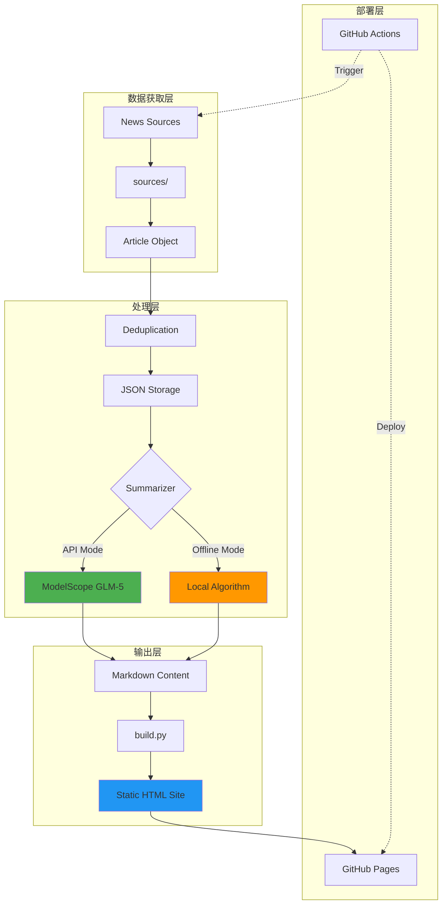
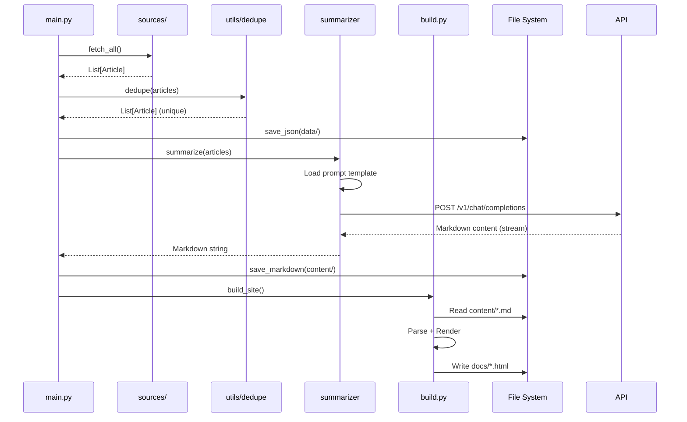

# 系统架构文档

本文档描述 Daily Report Site 的技术架构、数据流和核心组件设计。

---

## 🏗️ 架构概览



---

## 📦 核心组件

### 1. 数据获取层 (`sources/`)

**职责**: 从多个新闻源抓取文章数据

**接口定义**:
```python
def fetch() -> List[Dict[str, str]]:
    """
    Returns:
        [
            {
                "title": "文章标题",
                "link": "https://...",
                "desc": "简短描述"
            },
            ...
        ]
    """
```

**当前支持的源**:
- `aibase.py`: AIBase (中文 AI 新闻)
- `techcrunch.py`: TechCrunch (英文科技新闻)
- `theverge.py`: The Verge (英文科技新闻)
- `syft.py`: Self-hosted Syft 实例 (需配置)

**扩展机制**:
- Registry Pattern: `sources/__init__.py` 中的 `SOURCE_REGISTRY`
- 通过 `config.yaml` 动态启用/禁用

---

### 2. 数据处理层

#### 2.1 去重逻辑 (`utils/dedupe.py`)

**算法**: 基于 URL 和标题相似度的混合去重

```python
def dedupe(articles: List[Article]) -> List[Article]:
    """
    1. URL 精确匹配去重
    2. 标题 Levenshtein 距离 < 阈值视为重复
    3. 保留最早获取的版本
    """
```

**配置**: `config.yaml` 中的 `limits.max_articles`

#### 2.2 摘要生成 (`summarizer.py`)

**模式切换**:

| 模式 | 触发条件 | 使用场景 |
|------|---------|---------|
| API Mode | `MODELSCOPE_API_KEY` 已配置 | 生产环境，高质量摘要 |
| Offline Mode | 无 API Key 或 `--offline` 参数 | 本地测试，快速预览 |

**API Mode 流程**:
```python
# 1. 加载 Prompt 模板
with open("prompts/daily.md") as f:
    system_prompt = f.read()

# 2. 构造请求
messages = [
    {"role": "system", "content": system_prompt},
    {"role": "user", "content": json.dumps(articles, ensure_ascii=False)}
]

# 3. 调用 ModelScope API
response = requests.post(
    "https://api.modelscope.cn/v1/chat/completions",
    headers={"Authorization": f"Bearer {api_key}"},
    json={
        "model": "ZhipuAI/GLM-5",
        "messages": messages,
        "stream": True  # 流式输出
    }
)
```

**Offline Mode 逻辑**:
- 直接格式化文章列表为 Markdown
- 保留标题、链接和描述
- 无智能摘要和重新组织

---

### 3. 静态站点生成 (`build.py`)

**输入**: `content/*.md` (Markdown 文件)  
**输出**: `docs/*.html` (静态网页)

**模板系统**:
```python
# 文章模板
ARTICLE_TEMPLATE = """
<!DOCTYPE html>
<html>
  <head>...</head>
  <body>
    <nav>...</nav>
    <article>{html_content}</article>
    <footer>...</footer>
  </body>
</html>
"""

# 首页模板
INDEX_TEMPLATE = """
...
<div class="latest-post">{featured_card}</div>
<div class="posts-grid">{all_cards}</div>
...
"""
```

**构建流程**:
1. 扫描 `content/` 目录
2. 解析 Markdown → HTML (使用 `python-markdown`)
3. 按日期排序
4. 生成首页 (index.html)
5. 生成归档页 (archive.html)
6. 为每篇文章生成独立页面 (`YYYY-MM-DD.html`)
7. 复制静态资源 (`assets/style.css`)

---

## 🔄 数据流详解

### 完整流程 (main.py run)



### 分步执行

**仅抓取**:
```bash
python main.py fetch
# 输出: data/YYYY-MM-DD.json
```

**仅摘要**:
```bash
python main.py summarize
# 输入: data/YYYY-MM-DD.json
# 输出: content/YYYY-MM-DD.md
```

**仅构建**:
```bash
python main.py build
# 输入: content/*.md
# 输出: docs/*.html
```

---

## ⚙️ 配置管理 (`config.py`)

**配置优先级**:
1. 环境变量 (`.env`)
2. YAML 配置文件 (`config.yaml`)
3. 默认值

**实现**:
```python
from dataclasses import dataclass
from pathlib import Path
import yaml
from dotenv import load_dotenv
import os

@dataclass
class Config:
    api_key: str
    model: str
    sources: dict
    max_articles: int
    # ...

def get_config() -> Config:
    load_dotenv()
    
    with open("config.yaml") as f:
        yaml_cfg = yaml.safe_load(f)
    
    return Config(
        api_key=os.getenv("MODELSCOPE_API_KEY", ""),
        model=os.getenv("MODELSCOPE_MODEL", "ZhipuAI/GLM-5"),
        sources=yaml_cfg["sources"],
        max_articles=yaml_cfg["limits"]["max_articles"],
        # ...
    )
```

---

## 🚀 部署架构

### GitHub Actions 工作流

**触发条件**:
- `schedule`: 每天 01:00 UTC (09:00 北京时间)
- `workflow_dispatch`: 手动触发

**作业流程**:
```yaml
jobs:
  generate-and-deploy:
    runs-on: ubuntu-latest
    steps:
      - name: Checkout repo
      - name: Setup Python
      - name: Install dependencies
      - name: Run daily report
        env:
          MODELSCOPE_API_KEY: ${{ secrets.MODELSCOPE_API_KEY }}
        run: python main.py run
      - name: Commit changes
        run: |
          git add .
          git commit -m "Daily report: $(date)"
          git push
      - name: Deploy to Pages
        uses: actions/upload-pages-artifact@v2
```

### GitHub Pages 配置

- **Source**: GitHub Actions (推荐) 或 `gh-pages` 分支
- **Custom Domain**: 可选配置 CNAME
- **HTTPS**: 自动启用

---

## 🔒 安全考虑

### API Key 管理

**本地开发**:
- 存储在 `.env` (Git 忽略)
- 示例模板: `.env.example`

**GitHub Actions**:
- 使用 Repository Secrets
- 不在日志中暴露

### 依赖安全

**定期检查**:
```bash
pip install safety
safety check -r requirements.txt
```

---

## 📈 性能优化

### 当前性能指标

| 阶段 | 时间 | 瓶颈 |
|------|------|------|
| 抓取 (3 源) | ~5s | 网络请求 |
| 去重 | <1s | - |
| AI 摘要 | ~15s | API 延迟 |
| 构建 HTML | <2s | - |
| **总计** | **~23s** | - |

### 优化策略

**并发抓取**:
```python
# 当前: 串行
for source in enabled_sources:
    articles.extend(fetch_function())

# 优化: 并发
from concurrent.futures import ThreadPoolExecutor

with ThreadPoolExecutor(max_workers=5) as executor:
    futures = [executor.submit(fetch_fn) for fetch_fn in fetch_functions]
    results = [f.result() for f in futures]
```

**缓存机制** (待实现):
- 文章去重缓存 (避免重复处理)
- HTML 模板缓存 (减少文件 I/O)

---

## 🧪 测试策略

### 单元测试覆盖

```
sources/
  ✅ aibase.py (Mock HTTP 响应)
  ✅ techcrunch.py
  ✅ theverge.py

utils/
  ✅ dedupe.py (边界情况测试)
  ✅ datetime.py

summarizer.py
  ⚠️  API Mode (需要 Mock)
  ✅ Offline Mode
```

### 集成测试

**端到端测试**:
```bash
# 离线模式完整流程
python main.py run --offline
# 验证: docs/index.html 生成成功
```

**API 连接测试**:
```bash
python main.py test
# 验证: ModelScope API 可达
```

---

## 📚 扩展点

### 1. 添加新闻源

**接口**: `sources/new_source.py`  
**文档**: [docs/guides/extending-sources.md](docs/guides/extending-sources.md)

### 2. 自定义摘要模型

**配置**: `.env` 中的 `MODELSCOPE_MODEL`  
**兼容性**: 支持所有 OpenAI-Compatible API

### 3. 主题定制

**文件**: `assets/style.css`  
**变量**:
```css
:root {
  --primary-color: #4CAF50;
  --bg-color: #f5f5f5;
  --text-color: #333;
}
```

---

## 🔮 未来规划

- [ ] **RSS Feed 支持**: 生成 `feed.xml`
- [ ] **搜索功能**: 全文搜索
- [ ] **分类标签**: 按主题分类
- [ ] **多语言支持**: i18n 框架
- [ ] **Analytics**: 访问统计

---

**Last Updated**: 2026-01-21  
**Version**: 1.0.0
